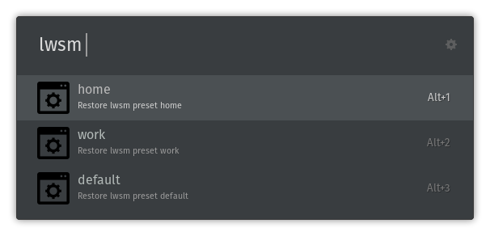

# ulauncher-lwsm

> Launcher for [Linux Window Session Manager](https://github.com/johannesjo/linux-window-session-manager/)

## Requirements

- [ulauncher](https://ulauncher.io/)
- Python >= 2.7
- [Linux Window Session Manager (LWSM)](https://github.com/johannesjo/linux-window-session-manager/)

## Install

Ulauncher preferences > Extensions > Add extension 

Use the following url:
`https://github.com/kpost/ulauncher-lwsm`